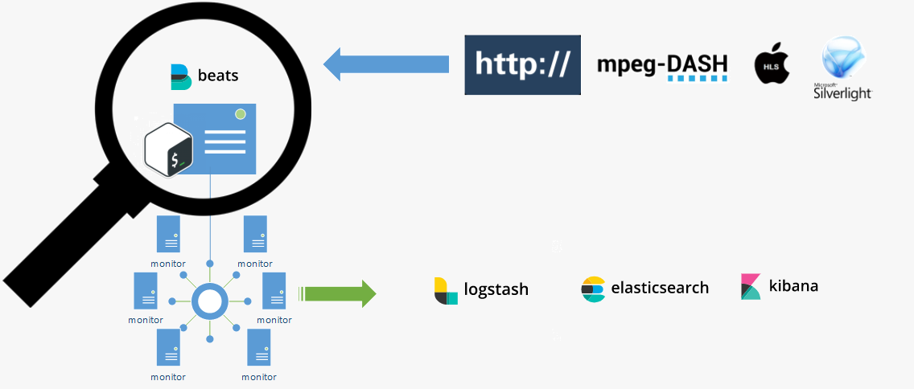
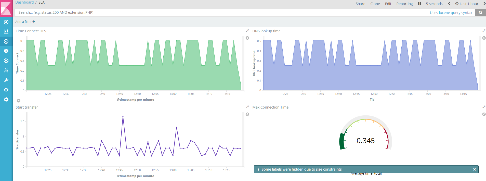

# HTTP-monitoring

Complete solution for prob monitoring HTTP services with several prob agents with a central reporting portal.
The project includes realtime monitoring and SLA reporting with Kibana.




### Monitor parameters


**Time Connect** The time, in seconds, it took from the start until the TCP connect to the remote host (or proxy) was completed.<br />

**Time Namelookup** The time, in seconds, it took from the start until the name resolving was completed.<br />

**Time Pretransfer** The time, in seconds, it took from the start until the file transfer was just about to begin. This includes all pre-transfer commands and negotiations that are specific to the particular protocol(s) involved.<br />

**Time starttransfer** The time, in seconds, it took from the start until the first byte was just about to be transferred. This includes Time pretransfer and also the time the server needed to calculate the result.<br />

**Time redirect** The time, in seconds, it took for all redirection steps including name lookup, connect, pretransfer and transfer before the final transaction was started. time_redirect shows the complete execution time for multiple redirections.<br />

**Time Total** The total time, in seconds, that the full operation lasted.<br />


##### Roadmap

- [x] v0.1 monitor HTTP
- [ ] v0.2 monitor HLS
- [ ] v0.3 monitor MSS
- [ ] v0.4 monitor DASH
- [ ] v.1 Raspberry pi prob

#### Requriments

##### Server
Ubuntu 16.04 x64
20 GB disk
6 GB ram

##### Prob
Ubuntu 16.04 x64
6 GB disk
384 MB ram

## Setup servers

#### Preparations

Install git
```
sudo apt-get -y install git

```
Make tmp directory and clone HTTP-monitoring
```
sudo mkdir /tmp
cd /tmp
git clone https://github.com/Caripson/HTTP-monitoring.git

```

### Install Java SDK

Download  jdk-8u144-linux-x64.tar.gz from http://www.oracle.com/technetwork/java/javase/downloads/jdk8-downloads-2133151.html to /tmp

Upload the file to http://transfer.sh so that you can easly install it later on monitor probes
```
cd /tmp
curl --upload-file ./jdk-8u144-linux-x64.tar.gz  https://transfer.sh/jdk-8u144-linux-x64.tar.gz
```
Start the installation
```
chmod +x /tmp/HTTP-monitoring/install-jdk8.sh
# Without downloading file
/tmp/HLS-monitoring/install-jdk8.sh false
# Download file
/tmp/HLS-monitoring/install-jdk8.sh true URL-to-JDK-file
```

### Install Elasticsearch
```
# add the Elastic APT repo
echo "deb https://artifacts.elastic.co/packages/5.x/apt stable main" | sudo tee -a /etc/apt/sources.list.d/elastic-5.x.list

# trust the signing key
sudo apt-key adv --keyserver hkp://pgp.mit.edu:80 --recv D88E42B4

# update repo information
sudo apt-get -yq install apt-transport-https
sudo apt-get -yq update

# install
sudo apt-get -yq install elasticsearch

```

#### Configuration Elasticsearch
```
chmod +x /tmp/HTTP-monitoring/elasticsearch.sh
/tmp/HTTP-monitoring/elasticsearch.sh
```

### Install Logstash

Download and install the Public Signing Key:
```
wget -qO - https://artifacts.elastic.co/GPG-KEY-elasticsearch | sudo apt-key add -
```
You may need to install the apt-transport-https package on Debian before proceeding:
```
sudo apt-get install apt-transport-https
```
Save the repository definition to /etc/apt/sources.list.d/elastic-5.x.list:
```
echo "deb https://artifacts.elastic.co/packages/5.x/apt stable main" | sudo tee -a /etc/apt/sources.list.d/elastic-5.x.list
```
Run sudo apt-get update and the repository is ready for use. You can install it with:
```
sudo apt-get update && sudo apt-get install logstash
```
#### Configuration Logstash
```
chmod +x /tmp/HTTP-monitoring/logstash.sh
/tmp/HTTP-monitoring/logstash.sh
```

### Install Kibana
```
sudo apt-get -yq install kibana

```
#### Configuration Kibana
```
chmod +x /tmp/HTTP-monitoring/kibana.sh
/tmp/HTTP-monitoring/kibana.sh
```

### Install X-Pack
```
# install x-pack for elasticsearch  (reply 'y' to permissions question)
cd /usr/share/elasticsearch
sudo bin/elasticsearch-plugin install x-pack

# install x-pack for kibana
cd /usr/share/kibana
sudo bin/kibana-plugin install x-pack

# install x-pack for logstash
cd /usr/share/logstash
sudo bin/logstash-plugin install x-pack

```

### Install Nginx
Use apt to install Nginx and Apache2-utils
```
sudo apt-get install nginx apache2-utils
```

#### Configuration Nginx
```
chmod +x /tmp/HTTP-monitoring/nginx.sh
/tmp/HTTP-monitoring/nginx.sh
```
### Start services
```
sudo systemctl start elasticsearch
sudo systemctl start kibana
sudo systemctl start logstash
```
### Load Kibana Dashboards

First, download the sample dashboards archive to your home directory:
```
cd ~
curl -L -O https://download.elastic.co/beats/dashboards/beats-dashboards-1.1.0.zip
```
Install the unzip package with this command:
```
sudo apt-get -y install unzip
```
Next, extract the contents of the archive:
```
unzip beats-dashboards-*.zip
```
And load the sample dashboards, visualizations and Beats index patterns into Elasticsearch with these commands:
```
cd beats-dashboards-*
./load.sh
```
### Load Filebeat Index Template in Elasticsearch


First, download the Filebeat index template to your home directory:
```
cd ~
curl -O https://gist.githubusercontent.com/thisismitch/3429023e8438cc25b86c/raw/d8c479e2a1adcea8b1fe86570e42abab0f10f364/filebeat-index-template.json
```
Then load the template with this command:
```
curl -XPUT 'http://localhost:9200/_template/filebeat?pretty' -d@filebeat-index-template.json
```
If the template loaded properly, you should see a message like this:
```
Output:
{
  "acknowledged" : true
}
```

### Troubleshooting


## Setup monitor probe
### Install Java SDK

Install git
```
sudo apt-get -y install git
```
Make tmp directory and clone HLS-monitoring
```
sudo mkdir /tmp
cd /tmp
git clone https://github.com/Caripson/HTTP-monitoring.git
```

### Install FileBeat
On monitor probe, create the Beats source list:
```
echo "deb https://packages.elastic.co/beats/apt stable main" |  sudo tee -a /etc/apt/sources.list.d/beats.list
```
It also uses the same GPG key as Elasticsearch, which can be installed with this command:
```
wget -qO - https://packages.elastic.co/GPG-KEY-elasticsearch | sudo apt-key add -
```
Then install the Filebeat package:
```
sudo apt-get update
sudo apt-get -y install filebeat
```

Update filebeat, press N
```
curl -L -O https://artifacts.elastic.co/downloads/beats/filebeat/filebeat-5.5.2-amd64.deb
sudo dpkg -i filebeat-5.5.2-amd64.deb
#### Configuration FileBeat
```

```
chmod +x /tmp/HLS-monitoring/filebeat.sh
/tmp/HLS-monitoring/filebeat.sh
```
Edit filebeat.yml
```
sudo vi /etc/filebeat/filebeat.yml
```
Update ELK Server IP with your monitor server ip
```
 ### Logstash as output
  logstash:
    # The Logstash hosts
    hosts: ["monitor_server_ip:5044"]
 ```
Now restart Filebeat to put our changes into place:
```
sudo service filebeat restart
sudo update-rc.d filebeat defaults 95 10
```


### Setup and Config bash script

```
chmod +x /tmp/HTTP-monitoring/watcher/runme.sh

```
Update URL
```
vi /tmp/HLS-monitoring/watcher/runme.sh
edit sURL=http://www.google.com/
```


### Start services
```
/tmp/HTTP-monitoring/watcher/runme.sh

```

### Troubleshooting
Check if logs is created
```
cat /home/2017*.log
```

## Kibana dasboard setup




# License

Unless stated otherwise all works are licensed under:
MIT License

# Contributors
Become a contributor to this project!

# Sponsors
No sponsors yet! Will you be the first?<br>
Become a contributor to this project!<br><br>
[](https://www.paypal.com/cgi-bin/webscr?cmd=_donations&business=johan%2ecaripson%40gmail%2ecom&lc=SE&currency_code=SEK&bn=PP%2dDonationsBF%3abtn_donateCC_LG%2egif%3aNonHosted)
